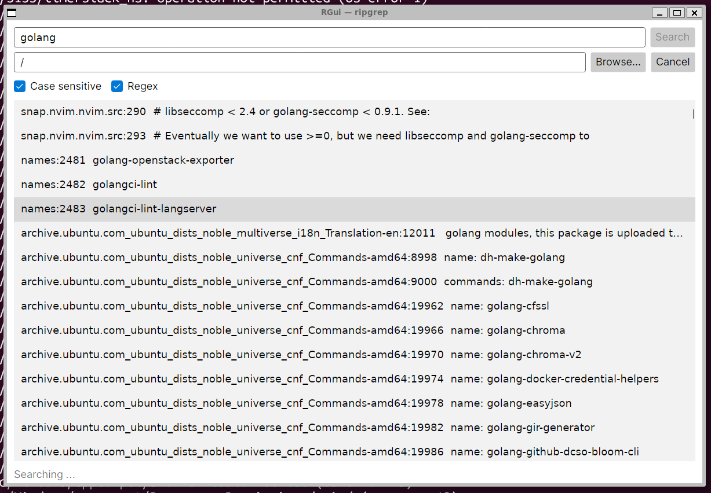

# RGui

A cross-platform desktop GUI for [ripgrep](https://github.com/BurntSushi/ripgrep).




## Features

- Live-streaming results as ripgrep finds them
- Case-sensitive / regex toggles
- Double-click any result to open it in VS Code at the correct line

## Requirements

- [.NET 10](https://dotnet.microsoft.com/download)
- [ripgrep](https://github.com/BurntSushi/ripgrep#installation) (`rg` must be on your `PATH`)

## Development Setup

<details>
<summary>Click to see...</summary>

After cloning, activate the git hooks:

```bash
git config core.hooksPath .githooks
```

This enables the pre-commit format check (`dotnet format --verify-no-changes`).

## Build & Run

```bash
dotnet run
```

## Publish (single-file binary)

```bash
# Linux
dotnet publish -c Release -r linux-x64 --self-contained -p:PublishSingleFile=true -p:IncludeNativeLibrariesForSelfExtract=true

# macOS (Apple Silicon)
dotnet publish -c Release -r osx-arm64 --self-contained -p:PublishSingleFile=true -p:IncludeNativeLibrariesForSelfExtract=true

# Windows
dotnet publish -c Release -r win-x64 --self-contained -p:PublishSingleFile=true -p:IncludeNativeLibrariesForSelfExtract=true
```
Output lands in `bin/Release/net10.0/<rid>/publish/`.
</details>

## Acknowledgements

This project is a GUI wrapper around [ripgrep](https://github.com/BurntSushi/ripgrep) by Andrew Gallant, which is licensed under the [MIT License](https://github.com/BurntSushi/ripgrep/blob/master/LICENSE-MIT).

## License

[MIT](LICENSE) © Christopher Ayre
